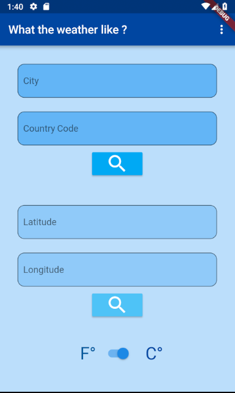
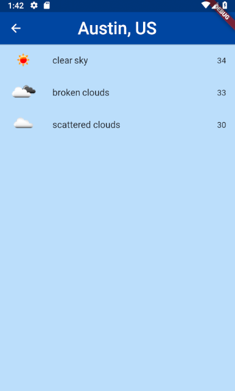
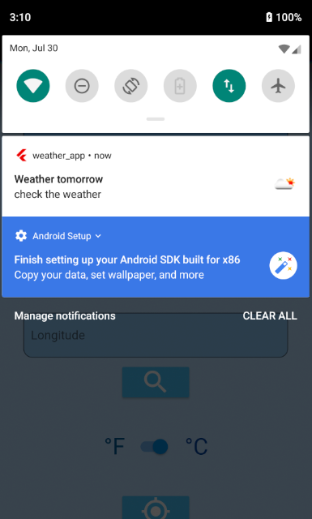

# Weather Application

*Author : F DALLA-VALLE*

You can search the weather with the name of the city, or with coordinates. 
You can choose degrees Celsius or degrees Fahrenheit for your results, and also the number of days you want.
This app allows to get notifications for the weather, where you are, each day.
You have to remove geolocation package if you want to put it in iOS. But I am searching a solution.

## Display

## IMPROVEMENTS :
* Weather by geolocation
* Add a list of previous searches
* Select the language of the results
* Add animations

## Sources :
* https://flutter.io/
* Tensor Programming (Weather App)
* https://classroom.udacity.com
* API : https://openweathermap.org/api
